---
## Front matter
lang: ru-RU
title: Лабораторная работа № 2. Julia. Структуры данных
subtitle: Компьютерный практикум по статистическому анализу данных
author:
  - Сунгурова М.М.
institute:
  - Российский университет дружбы народов, Москва, Россия
date: 23.11.24

## i18n babel
babel-lang: russian
babel-otherlangs: english

## Formatting pdf
toc: false
toc-title: Содержание
slide_level: 2
aspectratio: 169
section-titles: true
theme: metropolis
header-includes:
 - \metroset{progressbar=frametitle,sectionpage=progressbar,numbering=fraction}
---

# Информация

## Докладчик

:::::::::::::: {.columns align=center}
::: {.column width="70%"}

  * Сунгурова Мариян Мухсиновна
  * студентка группы НКНбд-01-21
  * Российский университет дружбы народов
  

:::
::: {.column width="30%"}

:::
::::::::::::::

# Вводная часть

## Цель работы 

- Основная цель работы -- изучить несколько структур данных, реализованных в Julia, научиться применять их и операции над ними для решения задач.

## Задачи

1. Используя Jupyter Lab, повторите примеры из раздела 2.2.
1. Выполните задания для самостоятельной работы (раздел 2.4).

## Материалы и методы

- Язык программирования `Julia` 

# Выполнение лабораторной работы

## Теоретическое введение

- Julia — высокоуровневый свободный язык программирования с динамической типизацией, созданный для математических вычислений. Эффективен также и для написания программ общего назначения. Синтаксис языка схож с синтаксисом других математических языков, однако имеет некоторые существенные отличия.

#  Выполнение лабораторной работы

##  Выполнение примеров

Рассмотрим несколько структур данных, реализованных в Julia.

Несколько функций (методов), общих для всех структур данных:

– isempty() — проверяет, пуста ли структура данных;

– length() — возвращает длину структуры данных;

– in() — проверяет принадлежность элемента к структуре;

– unique() — возвращает коллекцию уникальных элементов структуры,

– reduce() — свёртывает структуру данных в соответствии с заданным бинарным оператором;

– maximum() (или minimum()) — возвращает наибольший (или наименьший) результат вызова функции для каждого элемента структуры данных.

##  Выполнение примеров

Выполним примеры из лабораторной работы для действий над кортежами(рис. @fig:001 - @fig:002 )

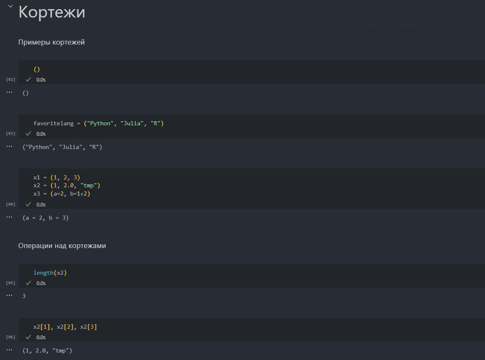{#fig:001 width=30%}

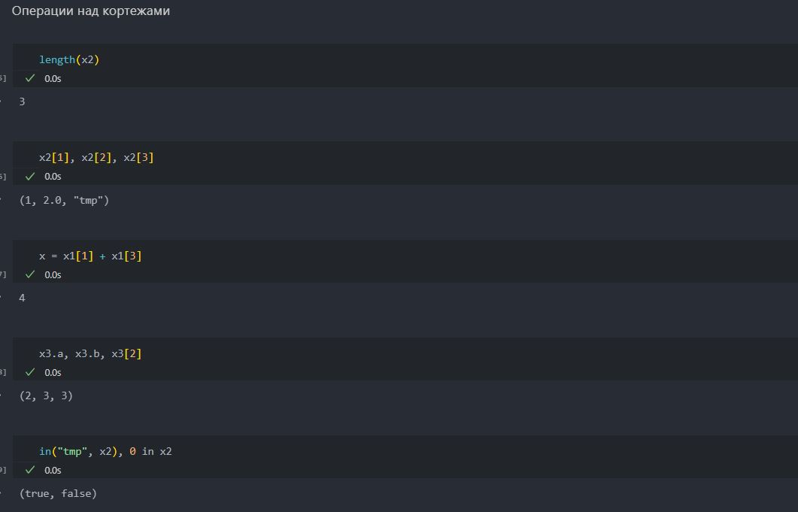{#fig:002 width=30%}

##  Выполнение примеров

Также со словарями(рис. @fig:003 - @fig:004)

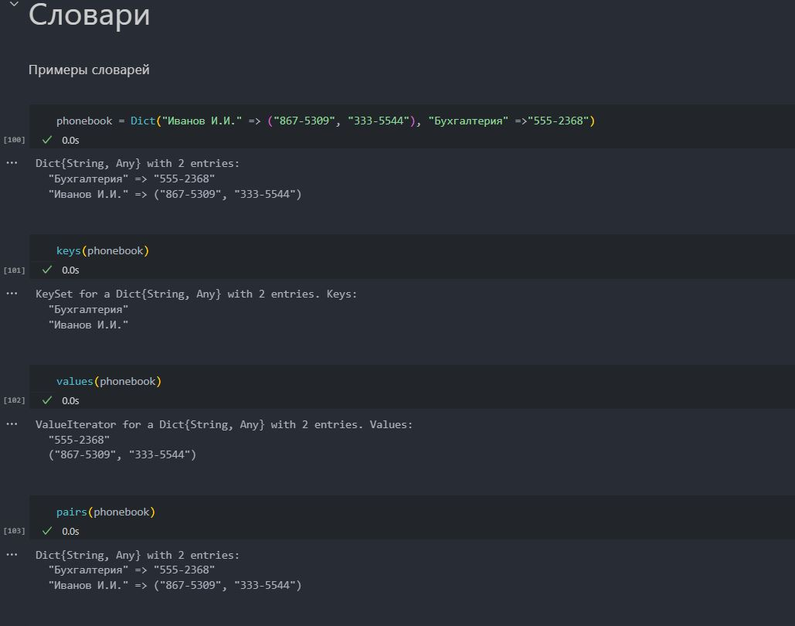{#fig:003 width=40%}

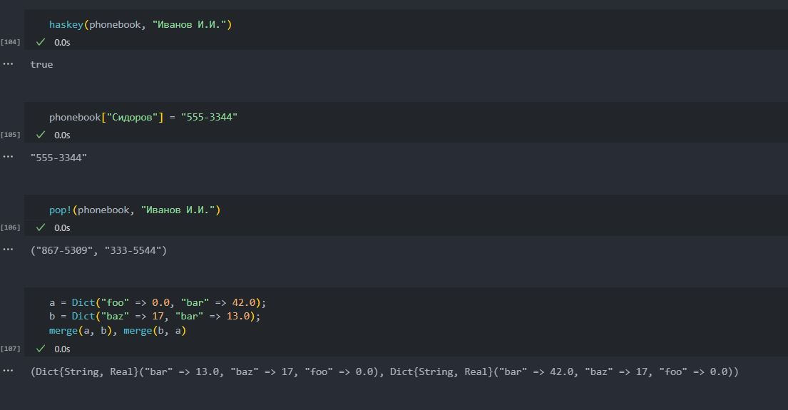{#fig:004 width=40%}

##  Выполнение примеров

Рассмотрим также примеры опреций над множествами(рис. @fig:005 - @fig:006)

{#fig:005 width=40%}

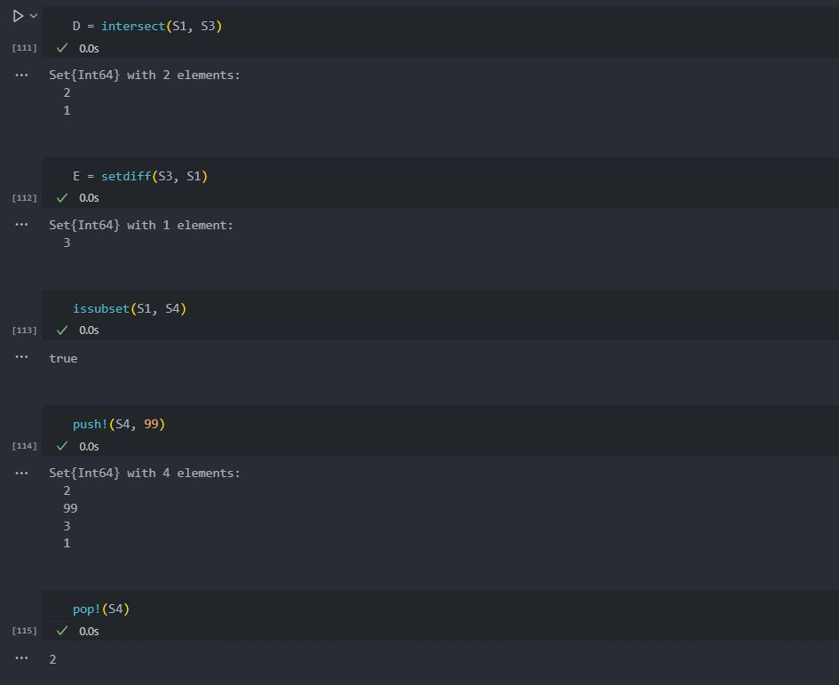{#fig:006 width=40%}

##  Выполнение примеров

И с массивами(рис. @fig:007 - @fig:011)

{#fig:007 width=40%}

{#fig:008 width=40%}

##  Выполнение примеров

{#fig:009 width=40%}

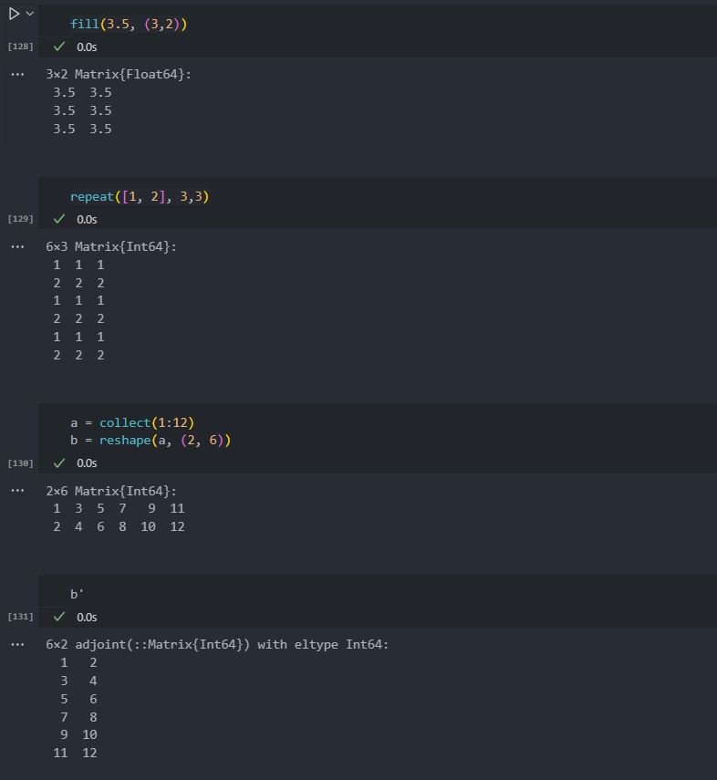{#fig:010 width=40%}

##  Выполнение примеров

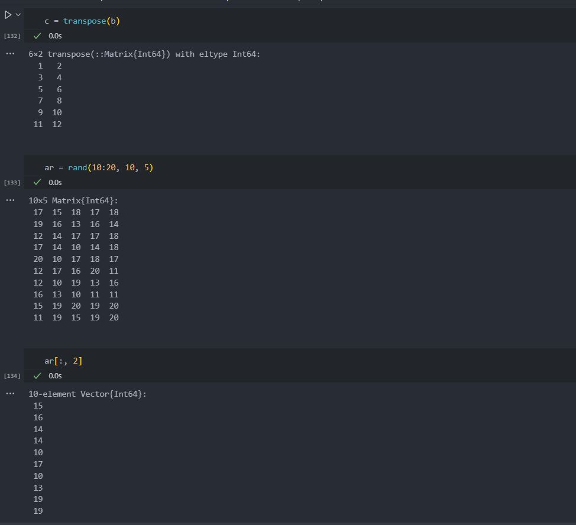{#fig:011 width=40%}

{#fig:012 width=40%}

##  Выполнение примеров

{#fig:013 width=70%}

##  Выполнение заданий для самостоятельной работы

Выполним задания для самостоятельной работы.

1. Даны множества: А = {0, 3, 4, 9}, В = {1, 3, 4, 7}, С = {0, 1, 2, 4, 7, 8, 9}. 
Найдем объединение пересечений этих множеств.(рис. @fig:014)

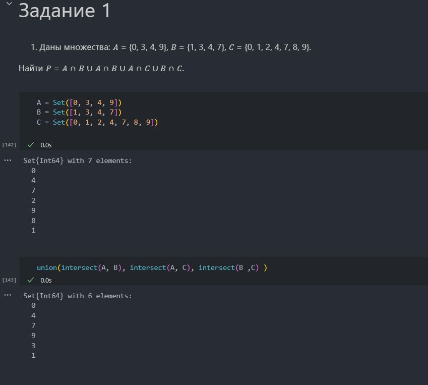{#fig:014 width=40%}

##  Выполнение заданий для самостоятельной работы

2. Приведем свои примеры с выполнением операций над множествами элементов
разных типов. (рис. @fig:016 - @fig:017)

{#fig:015 width=40%}

##  Выполнение заданий для самостоятельной работы

- Приведем свои примеры с выполнением операций над множествами элементов
разных типов

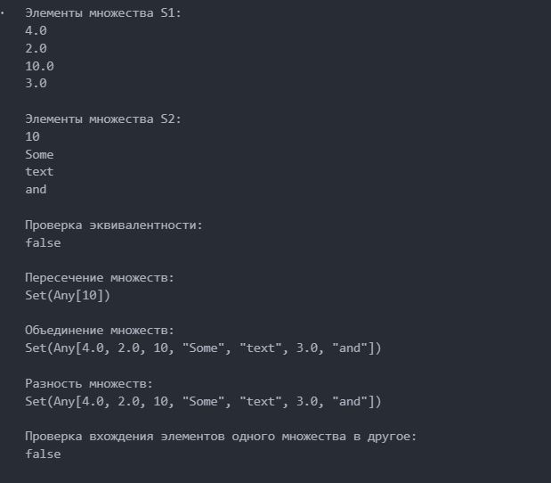{#fig:016 width=40%}

##  Выполнение заданий для самостоятельной работы

- Приведем свои примеры с выполнением операций над множествами элементов
разных типов

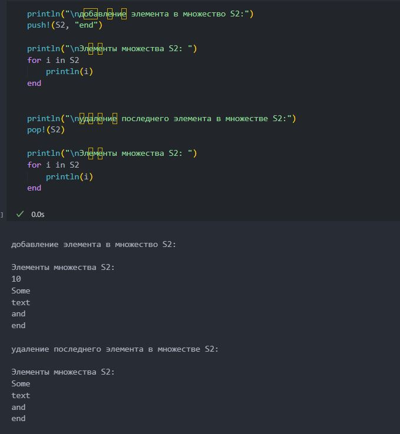{#fig:017 width=40%}

##  Выполнение заданий для самостоятельной работы

1. Создадим разными способами массивы и вектора. Для создания нужных массивов, используем генераторы и циклы(рис. @fig:018 - @fig:023)

{#fig:018 width=40%}

##  Выполнение заданий для самостоятельной работы

{#fig:019 width=70%}

##  Выполнение заданий для самостоятельной работы

{#fig:020 width=70%}

##  Выполнение заданий для самостоятельной работы

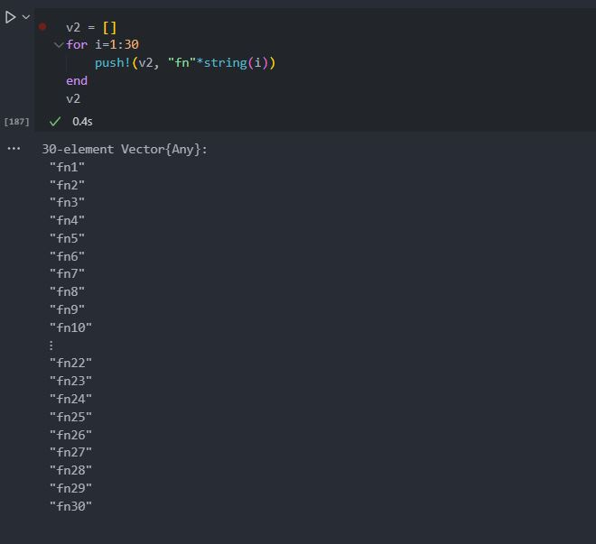{#fig:021 width=70%}

##  Выполнение заданий для самостоятельной работы

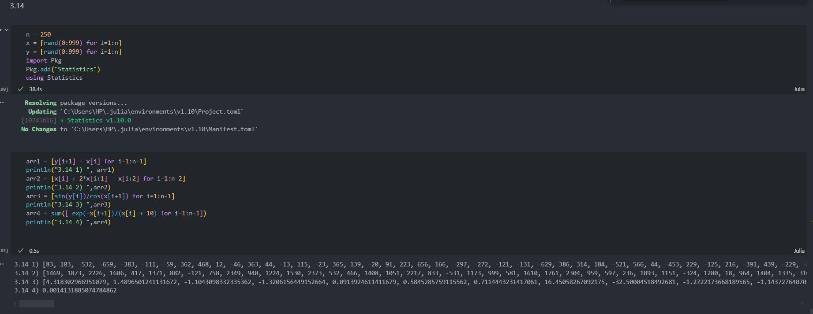{#fig:022 width=70%}

##  Выполнение заданий для самостоятельной работы

{#fig:023 width=70%}

##  Выполнение заданий для самостоятельной работы

4. Создадим массив squares, в котором будут храниться квадраты всех целых чисел от 1
до 100.(рис. @fig:024 )

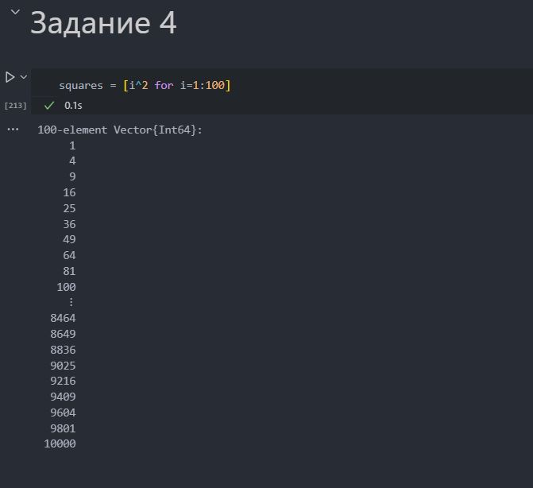{#fig:024 width=40%}

##  Выполнение заданий для самостоятельной работы

5. Подключим пакет Primes (функции для вычисления простых чисел). Затем сгенерируем массив myprimes, в котором будут храниться первые 168 простых чисел. 
Определим также 89-е наименьшее простое число и срез массива с 89-го до 99-го элемента включительно, содержащий наименьшие простые числа.(рис. @fig:025)

{#fig:025 width=40%}

##  Выполнение заданий для самостоятельной работы

6. Вычислим выражения(рис. @fig:026 )

{#fig:026 width=40%}

# Выводы

- В результате выполнения данной лабораторной работы были изучены структуры данных, реализованных в Julia: словарь, массив, кортеж множество, также были получены практические навыки применения этих структур и операций над ними решения задач.