---
## Front matter
lang: ru-RU
title: "Лабораторная работа № 4"
subtitle: "Линейная алгебра"
author:
  - Сунгурова Мариян
institute:
  - Российский университет дружбы народов, Москва, Россия
date: 07 декабря 2024

## i18n babel
babel-lang: russian
babel-otherlangs: english

## Formatting pdf
toc: false
toc-title: Содержание
slide_level: 2
aspectratio: 169
section-titles: true
theme: metropolis
header-includes:
 - \metroset{progressbar=frametitle,sectionpage=progressbar,numbering=fraction}
---

# Информация

## Докладчик

:::::::::::::: {.columns align=center}
::: {.column width="70%"}

  * Сунгурова Мариян Мухсиновна
  * НКНбд-01-21
  * Российский университет дружбы народов

:::
::: {.column width="30%"}

:::
::::::::::::::

# Вводная часть

## Цель работы

Основной целью данной работы является изучение возможностей специализированных пакетов Julia для выполнения и оценки эффективности операций над объектами линейной
алгебры.

## Задание

1. Используя JupyterLab, повторите примеры.
2. Выполните задания для самостоятельной работы.

## Теоретическое введение

Julia -- высокоуровневый свободный язык программирования с динамической типизацией, созданный для математических вычислений. Эффективен также и для написания программ общего назначения. Синтаксис языка схож с синтаксисом других математических языков, однако имеет некоторые существенные отличия.

Для выполнения заданий была использована официальная документация Julia.

# Выполнение лабораторной работы

Выполним примеры из раздела про поэлементные операции над многомерными массивами (рис. [-@fig:001]-[-@fig:002]).

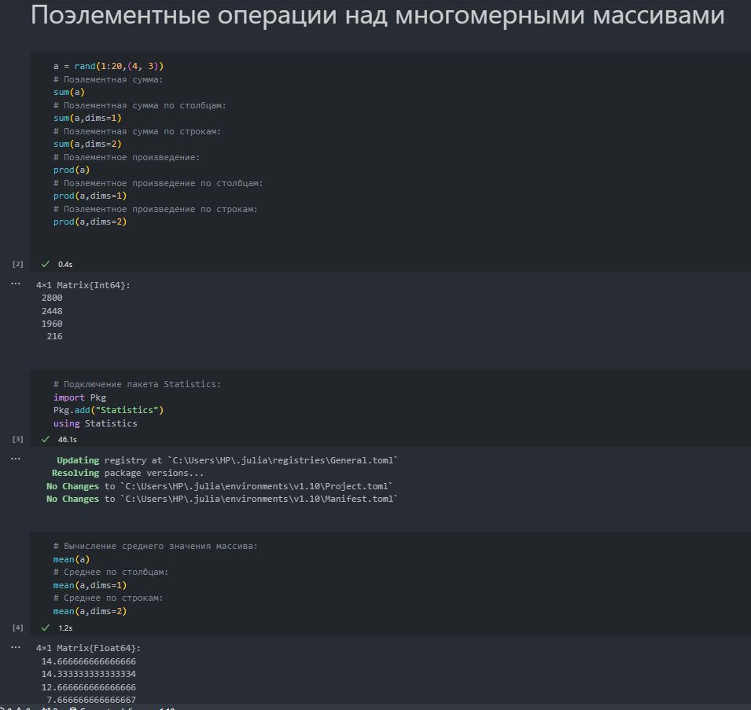{#fig:001 width=70%}

## Выполнение лабораторной работы

Выполним примеры из раздела про транспонирование,след,ранг,определительи инверсия матрицы (рис. [-@fig:003]).

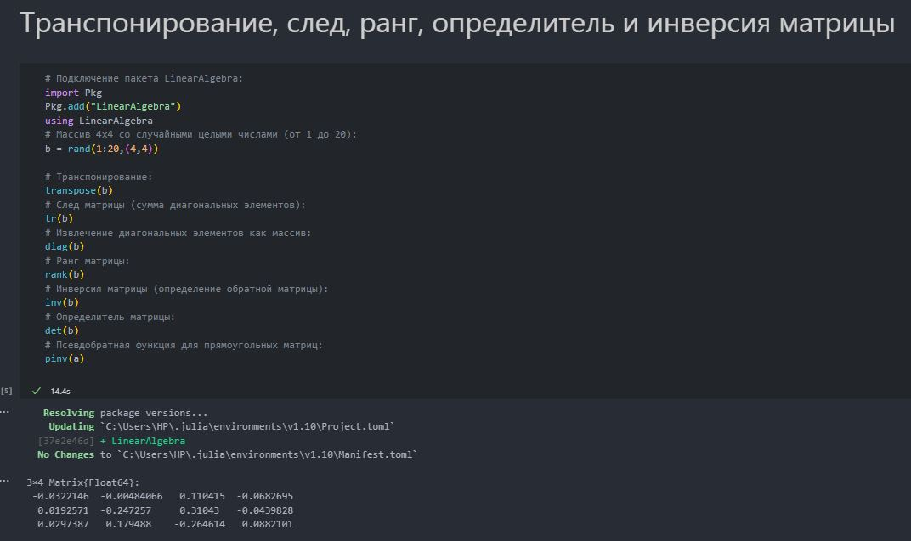{#fig:002 width=70%}

## Выполнение лабораторной работы

Выполним примеры из раздела про вычисление нормы векторов и матриц, повороты и вращения  (рис. [-@fig:003] - [-@fig:004]).

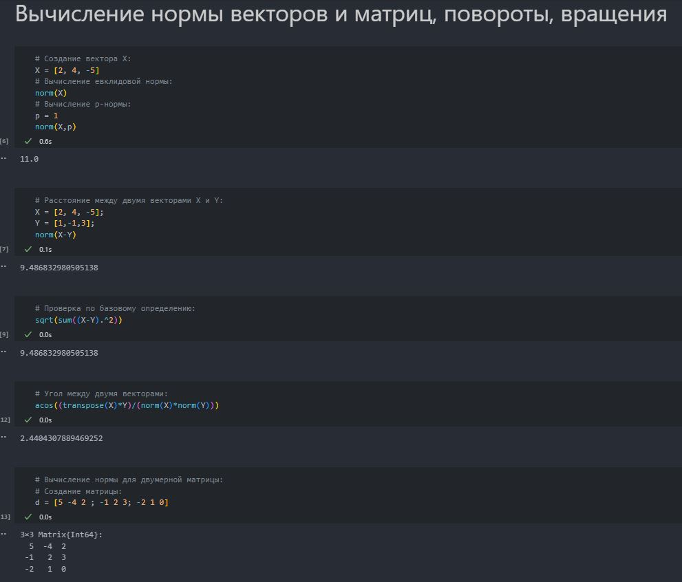{#fig:003 width=40%}

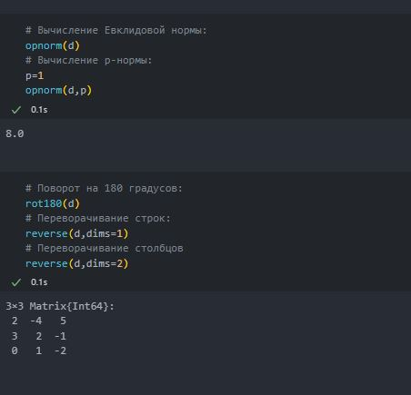{#fig:004 width=40%}

## Выполнение лабораторной работы

Выполним примеры из раздела про матричное умножение,единичная матрица,скалярное
произведение (рис. [-@fig:005]).

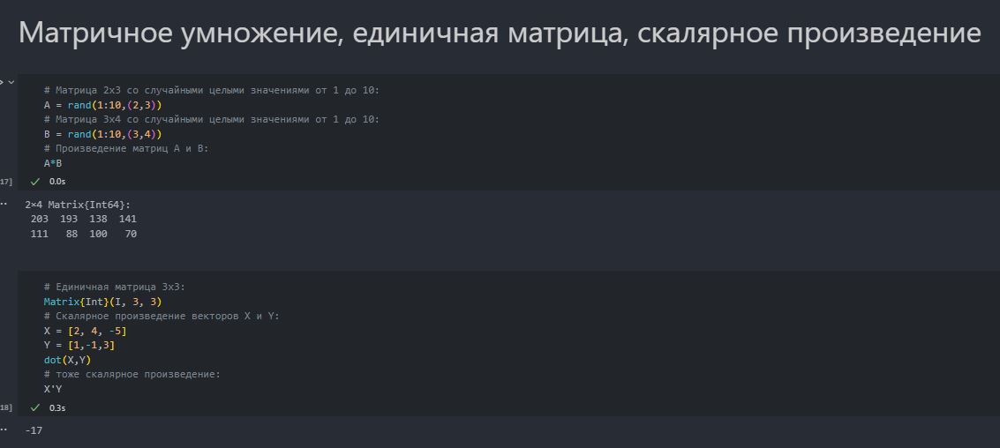{#fig:005 width=70%}

## Выполнение лабораторной работы

Выполним примеры из раздела про факторизацию и специальные матричные структуры (рис. [-@fig:006]-[-@fig:008]).

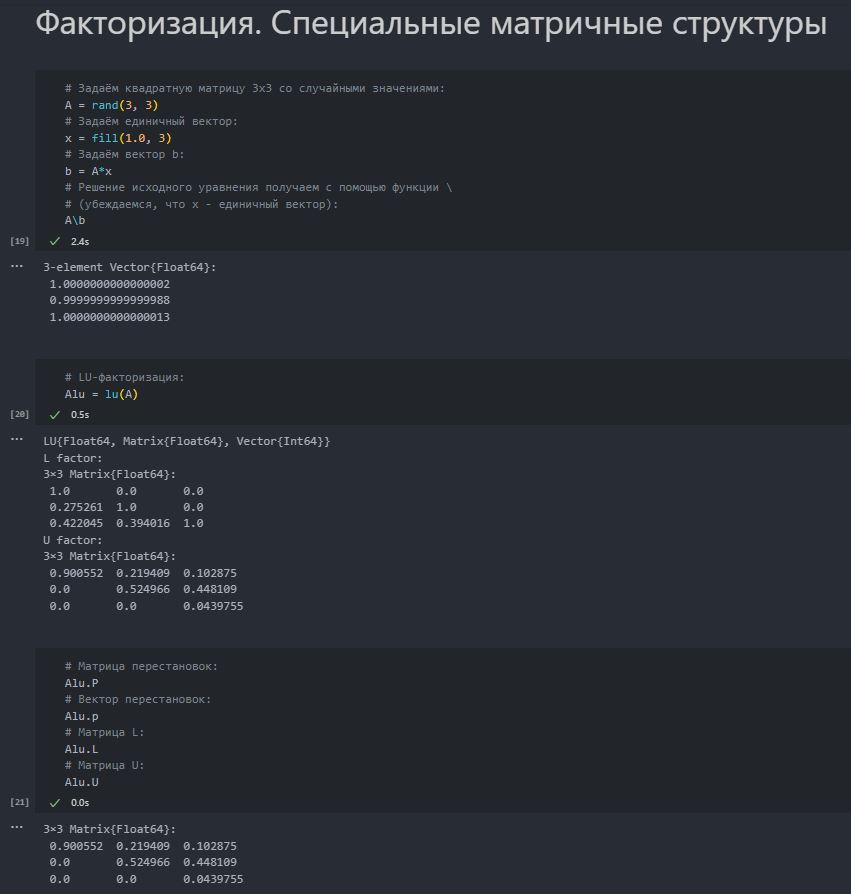{#fig:006 width=70%}

## Выполнение лабораторной работы

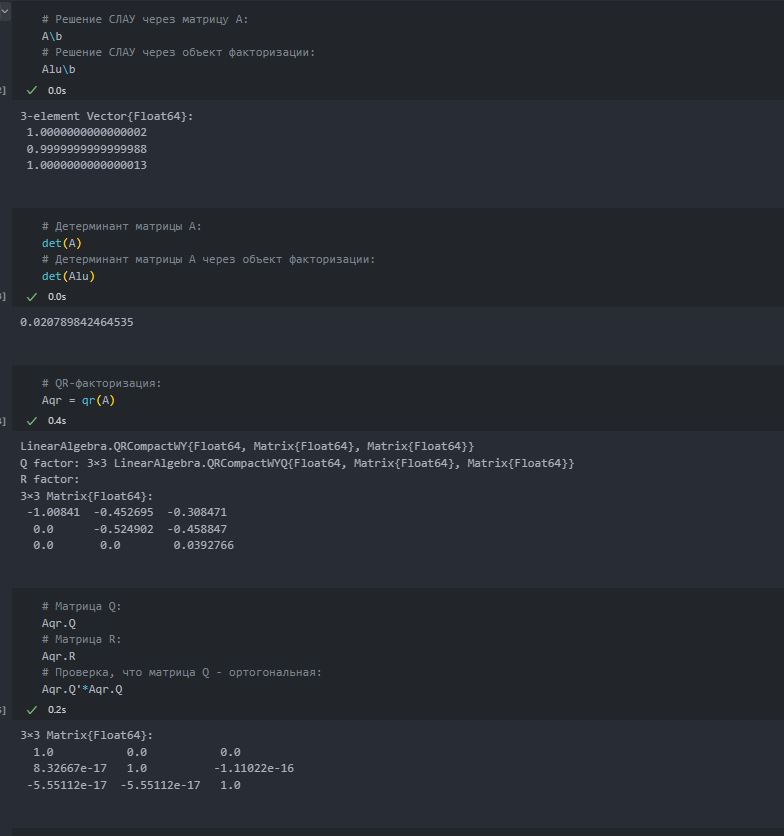{#fig:007 width=70%}

## Выполнение лабораторной работы

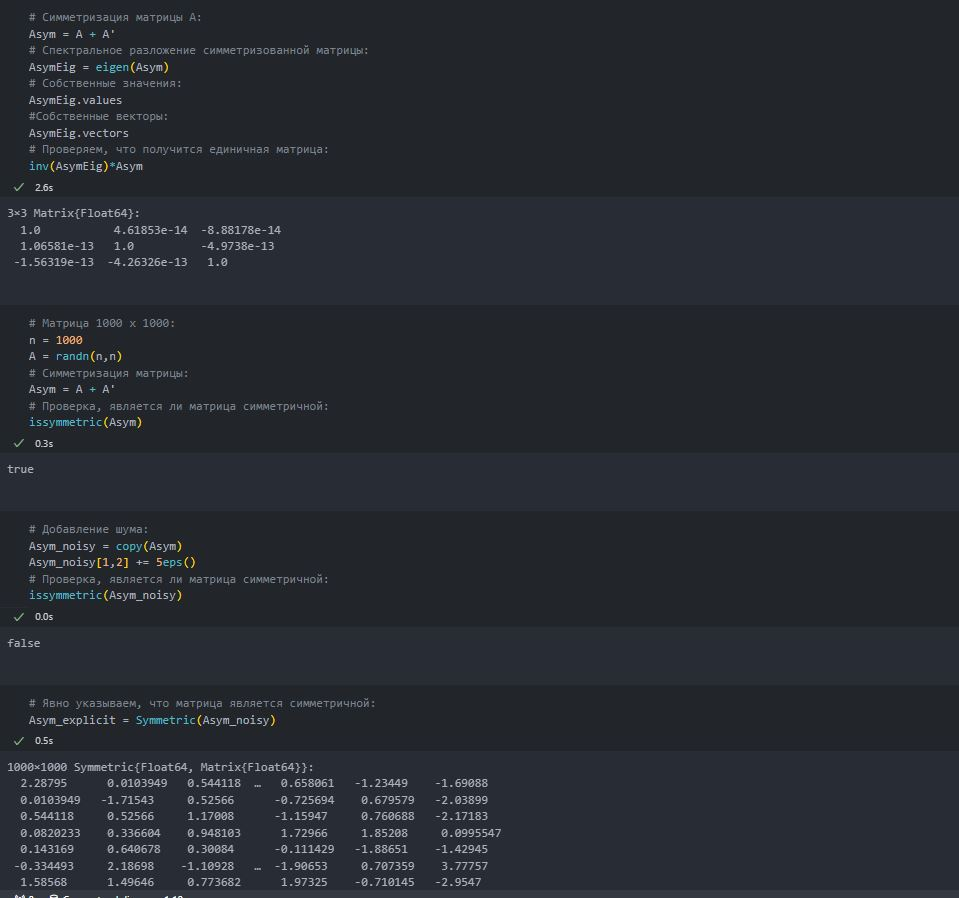{#fig:008 width=70%}

## Выполнение лабораторной работы

Далее для оценки эффективности выполнения операций над матрицами большой
размерности и специальной структуры воспользуемся пакетом BenchmarkTools

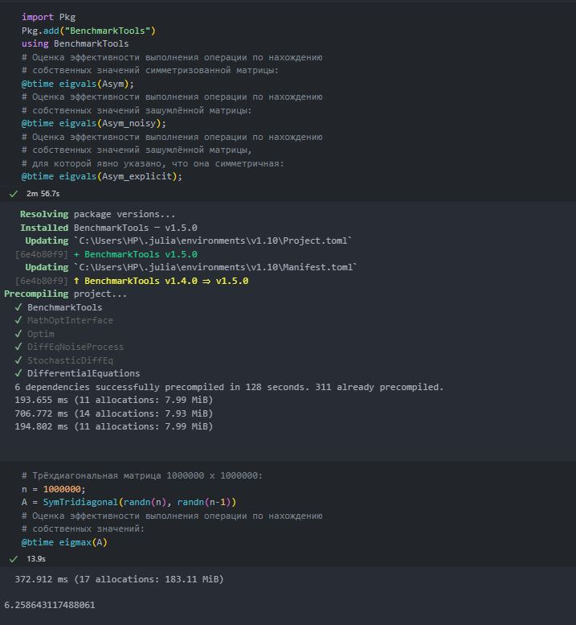{#fig:009 width=70%}

## Выполнение лабораторной работы

Выполним примеры из раздела про общую линейную алгебру (рис. [-@fig:010]).

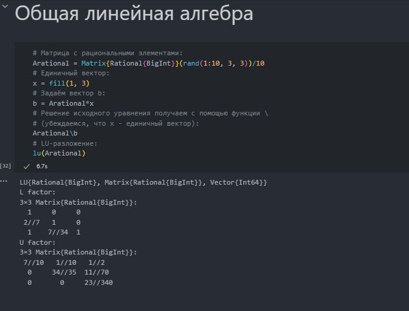{#fig:010 width=70%}

## Заданиядля самостоятельного выполнения

Зададим вектор v. Умножим вектор v скалярно сам на себя и сохраним результат
вdot_v Затем умножим v матрично на себя(внешнее произведение), присвоив результат переменной outer_v .(рис. [-@fig:011]).

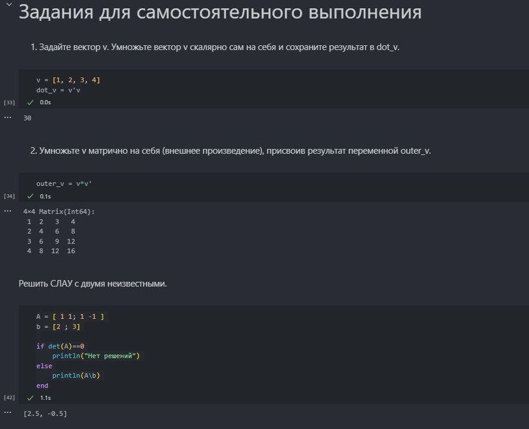{#fig:011 width=70%}

## Заданиядля самостоятельного выполнения

Решим СЛАУ с двумя неизвестными (рис. [-@fig:012]-[-@fig:013]).

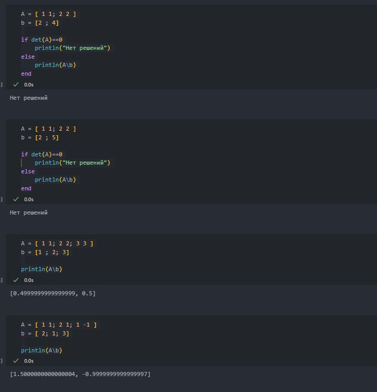{#fig:012 width=40%}

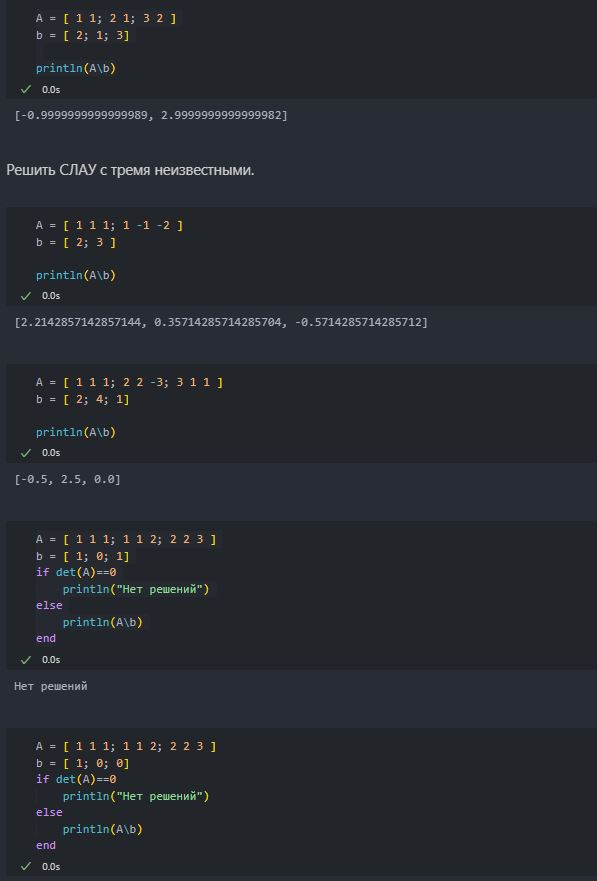{#fig:013 width=40%}

## Заданиядля самостоятельного выполнения

Решим СЛАУ с тремя неизвестными (рис. [-@fig:014]).

{#fig:014 width=70%}

## Заданиядля самостоятельного выполнения

Приведем матрицы к диагональному виду (рис. [-@fig:015]).

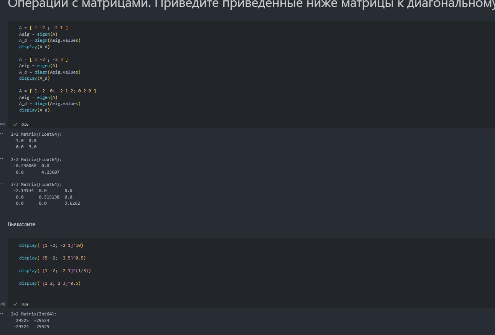{#fig:015 width=70%}

## Заданиядля самостоятельного выполнения

Вычислим (рис. [-@fig:016]).

{#fig:016 width=70%}

## Заданиядля самостоятельного выполнения

Найдем собственные значения матрицы A. Создадим диагональную матрицу из собственных значений матрицы A. Создадим
нижнедиагональную матрицу из матрицы A. Оценим эффективность выполняемых
операций (рис. [-@fig:017]).

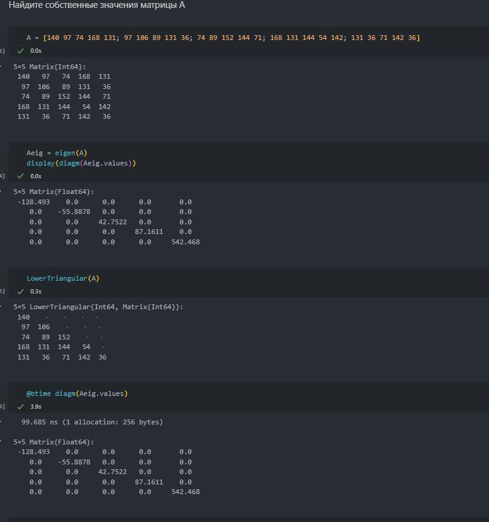{#fig:017 width=70%}

## Заданиядля самостоятельного выполнения

Линейная модель может быть записана как СЛАУ

$$x - Ax = y,$$

где элементы матрицы A и столбца y -- неотрицательные числа. По своему смыслу в экономике элементы матрицы A и столбцов x, y не могут быть отрицательными числами. 

Матрица A называется продуктивной,если решение x системы при любой неотрицательной правой части y имеет только неотрицательные элементы $x_i$.Используя это
определение, проверим, являются ли матрицып родуктивными (рис. [-@fig:018]-[-@fig:019]).

## Заданиядля самостоятельного выполнения

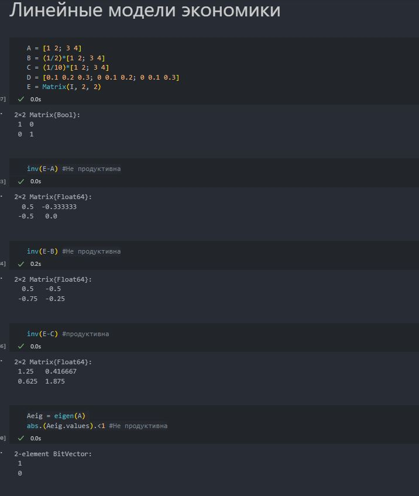{#fig:018 width=40%}

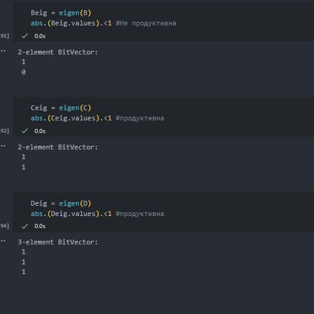{#fig:019 width=40%}

# Выводы

В процессе выполнения данной лабораторной работы были изучены возможности специализированных пакетов Julia для выполнения и оценки эффективности операций над объектами линейной алгебры.