---
## Front matter
lang: ru-RU
title: "Лабораторная работа № 6"
subtitle: "Решение моделей в непрерывном и дискретном времени"
author:
  - Сунгурова М.М.
institute:
  - Российский университет дружбы народов, Москва, Россия
date: 21 декабря 2024

## i18n babel
babel-lang: russian
babel-otherlangs: english

## Formatting pdf
toc: false
toc-title: Содержание
slide_level: 2
aspectratio: 169
section-titles: true
theme: metropolis
header-includes:
 - \metroset{progressbar=frametitle,sectionpage=progressbar,numbering=fraction}
---

# Информация

## Докладчик

:::::::::::::: {.columns align=center}
::: {.column width="70%"}

  * Сунгурова Мариян Мухсиновна
  * Студентка группы НКНбд-01-21
  * Российский университет дружбы народов

:::
::: {.column width="30%"}

:::
::::::::::::::

# Вводная часть

## Цель работы

Основной целью  данной лабораторной работы является освоение специализированных пакетов для решения задач в непрерывном и дискретном времени.

## Задание

1. Используя JupyterLab, повторите примерыи. При этом дополните графики
обозначениями осей координат, легендой с названиями траекторий, названиями
графиков и т.п.

2. Выполните задания для самостоятельной работы.

## Теоретическое введение

Julia -- высокоуровневый свободный язык программирования с динамической типизацией, созданный для математических вычислений . Эффективен также и для написания программ общего назначения. Синтаксис языка схож с синтаксисом других математических языков, однако имеет некоторые существенные отличия.

Для выполнения заданий была использована официальная документация Julia .

## Выполнение лабораторной работы

Выполним примеры из лабораторной работы для знакомства с работой с различными моделями и способами их задания  решения.

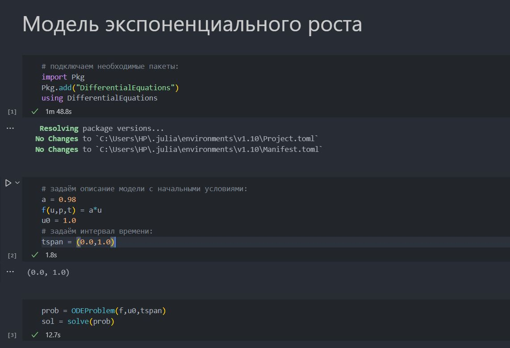{#fig:001 width=70%}

## Выполнение лабораторной работы

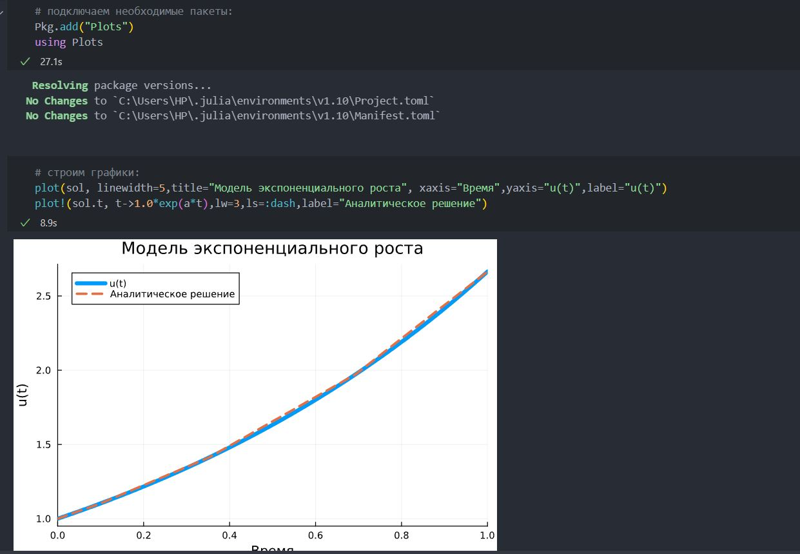{#fig:002 width=70%}

## Выполнение лабораторной работы

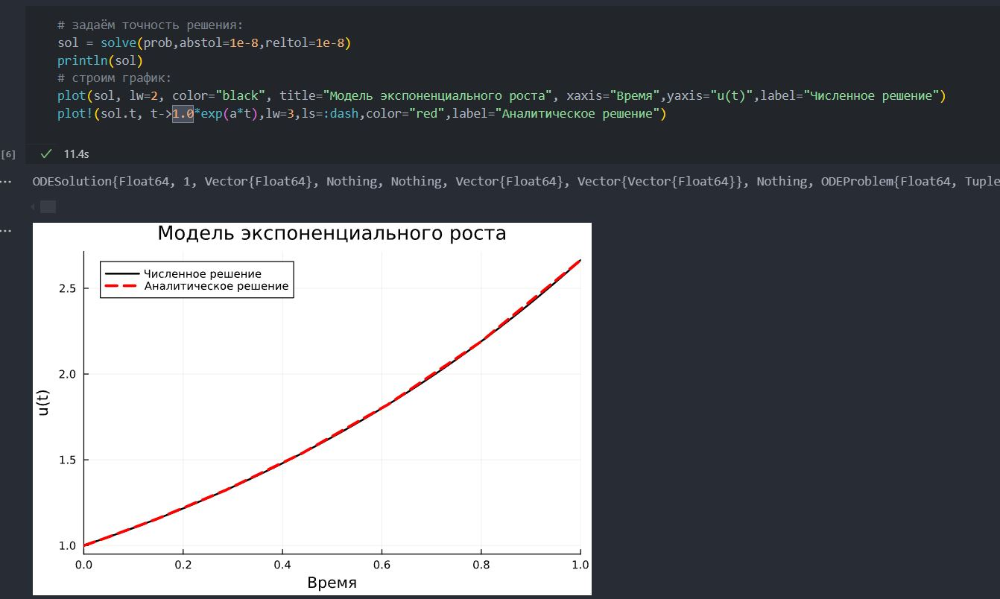{#fig:003 width=70%}

## Выполнение лабораторной работы

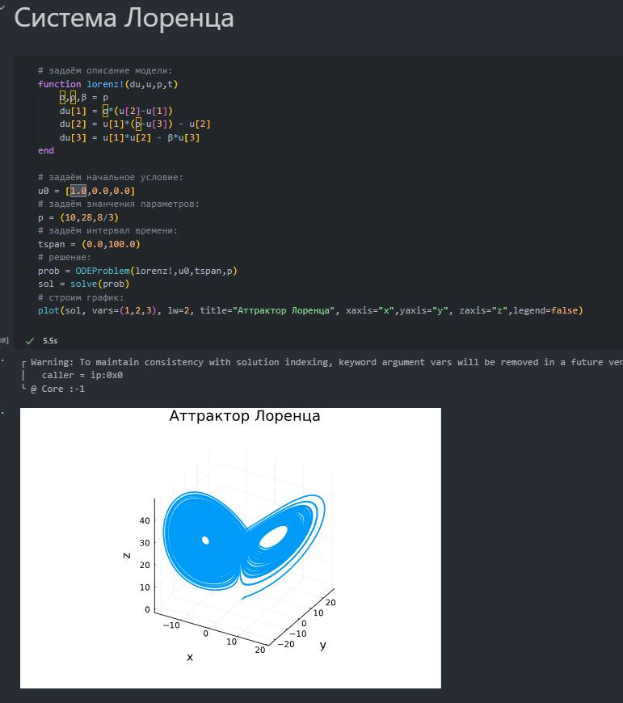{#fig:004 width=70%}

## Выполнение лабораторной работы

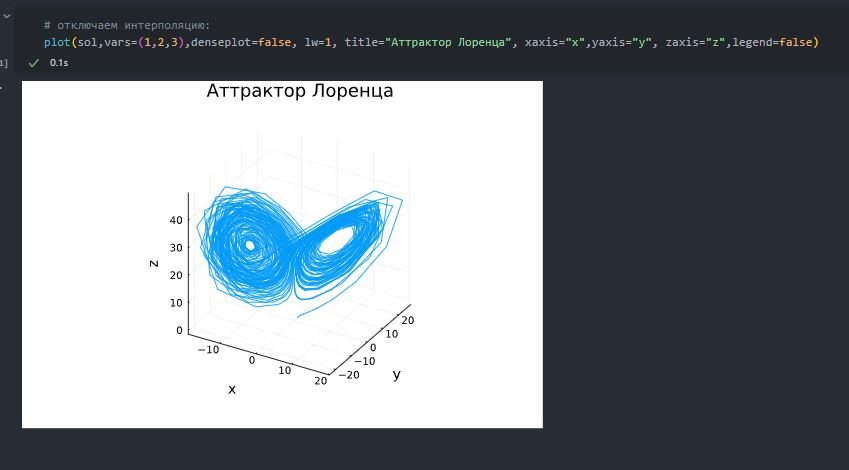{#fig:005 width=70%}

## Выполнение лабораторной работы

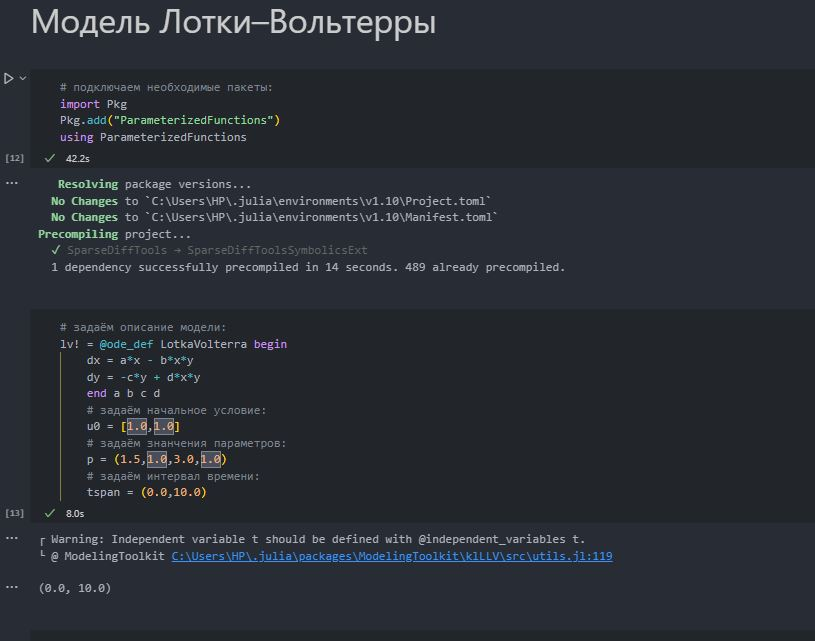{#fig:006 width=70%}

## Выполнение лабораторной работы

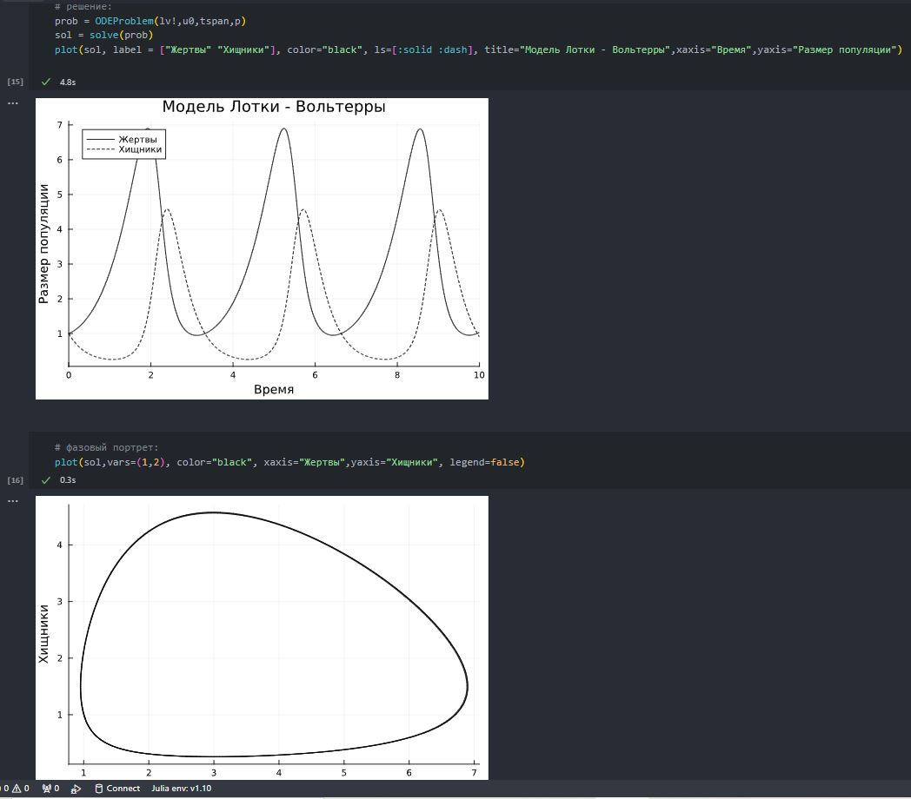{#fig:007 width=70%}

## Выполнение лабораторной работы

Далее перейдем к заданиям для самостоятельного выполнения.

В первом задании реализуем и проанализируем модель роста численности изолированной популяции(модель Мальтуса):

$$\dot x = ax, \quad a = b - c,$$

где $x(t)$ -- численность изолированной популяции в момент времени $t$,$a$ -- коэффициент роста популяции, $b$ -- коэффициент рождаемости, $c$ -- коэффициент смертности.
Построим соответствующие графики (в том числе с анимацией).

## Выполнение лабораторной работы

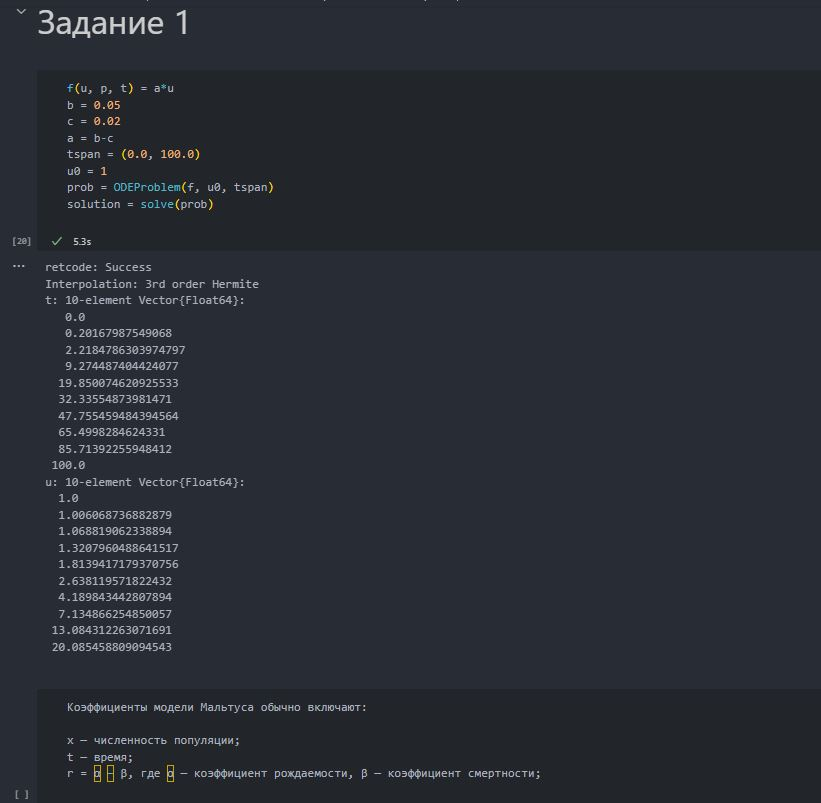{#fig:008 width=70%}

## Выполнение лабораторной работы

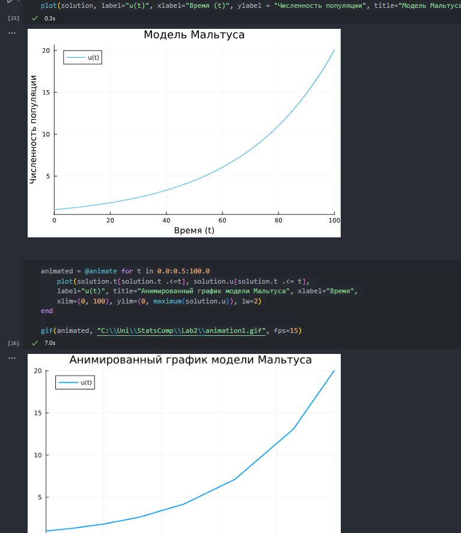{#fig:009 width=70%}

## Выполнение лабораторной работы

Далее во втором задании реализуем и проанализируем логистическую модель роста популяции:

$$\dot x = rx(1 - \dfrac{x}{k}), \quad r>0, \quad k>0,$$

где $r$ -- коэффициент роста популяции, $k$ -- потенциальная ёмкость экологической системы (предельное значение численности популяции).
Построим соответствующие графики (в том числе с анимацией) (рис. [-@fig:010]-[-@fig:011]).

## Выполнение лабораторной работы

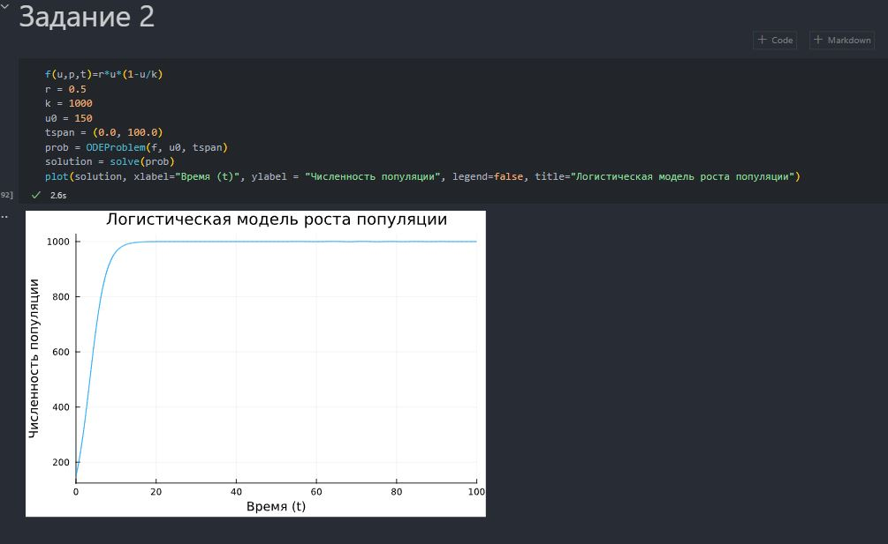{#fig:010 width=70%}

## Выполнение лабораторной работы

Анимация:

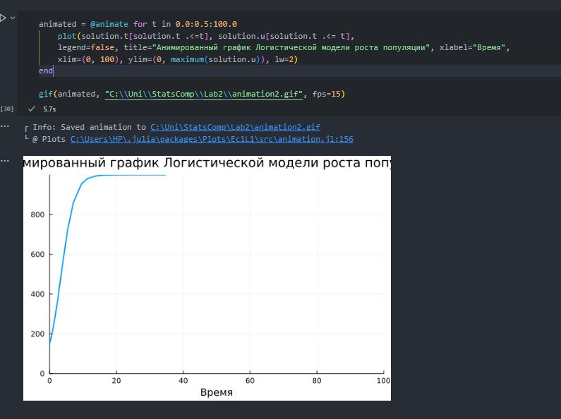{#fig:011 width=70%}

## Выполнение лабораторной работы

В заданиии номер 3 реализуем и проанализируем логистическую модель эпидемии Кермака–Маккендрика (SIR-модель):

$$
\begin{cases}
\dot S = - \beta I S, \\
\dot I = \beta I S - \gamma I, \\
\dot R = \gamma I,
\end{cases}
$$

где $S$ -- численность восприимчивой популяции, $I$ -- численность инфицированных, $R$ -- численность удаленной популяции (в результате смерти или выздоровления), и $N$ — это сумма этих трёх, а $\beta$ и $\gamma$ - это коэффициенты заболеваемости
и выздоровления соответственно

## Выполнение лабораторной работы

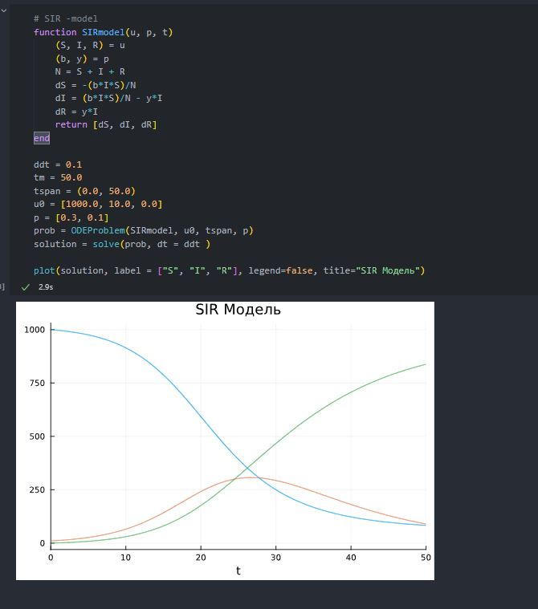{#fig:012 width=70%}

## Выполнение лабораторной работы

Также была реализована и анимация

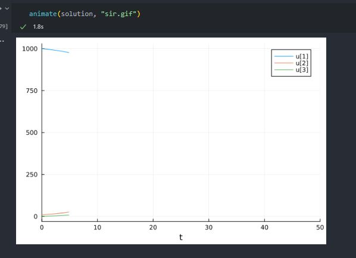{#fig:013 width=70%}

## Выполнение лабораторной работы

Далее в рамках четвертого задания как расширение модели SIR (Susceptible-Infected-Removed) по результатам эпидемии испанки была предложена модель SEIR (Susceptible-Exposed-Infected-Removed) (рис. [-@fig:009]).

$$
\begin{cases}
\dot S = - \dfrac{\beta}{N} I S, \\
\dot E = \dfrac{\beta}{N} I S - \delta E, \\
\dot I = \delta E - \gamma I, \\
\dot R = \gamma I,
\end{cases}
$$

## Выполнение лабораторной работы

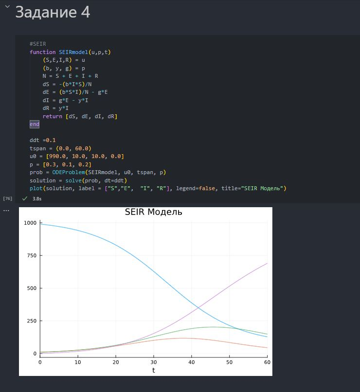{#fig:014 width=70%}

## Выполнение лабораторной работы

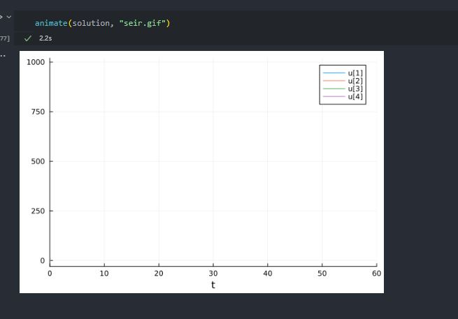{#fig:015 width=70%}

## Выполнение лабораторной работы

В задании номер 5 для дискретной модели Лотки–Вольтерры:

$$
\begin{cases}
X_1(t+1) = a X_1(t)(1-X_1(t)) - X_1(t) X_2(t), \\
X_2(t+1) = -c X_2(t) - d X_1(t) X_2(t).
\end{cases}
$$

с начальными данными $a = 2, c = 1, d = 5$ найдем точку равновесия. Получим и сравним аналитическое и численное решения.

## Выполнение лабораторной работы

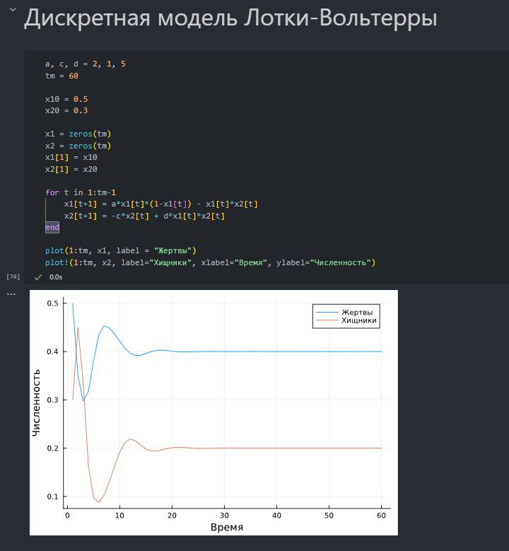{#fig:016 width=70%}

## Выполнение лабораторной работы

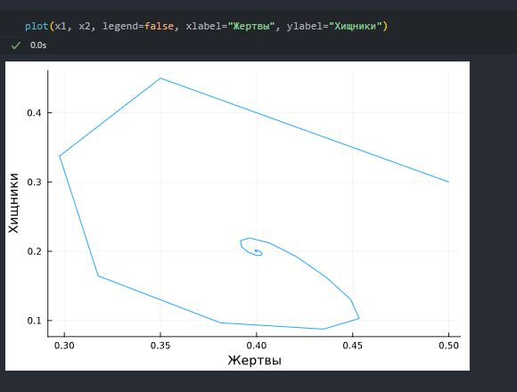{#fig:017 width=70%}

## Выполнение лабораторной работы

В задании 6 Реализуем на языке Julia модель отбора на основе конкурентных отношений:

$$
\begin{cases}
\dot x = \alpha x - \beta xy, \\
\dot y = \alpha y - \beta xy,
\end{cases}
$$

## Выполнение лабораторной работы

 Построим соответствующие графики (в том числе с анимацией) и фазовый портрет (рис. [-@fig:018]-[-@fig:019]).

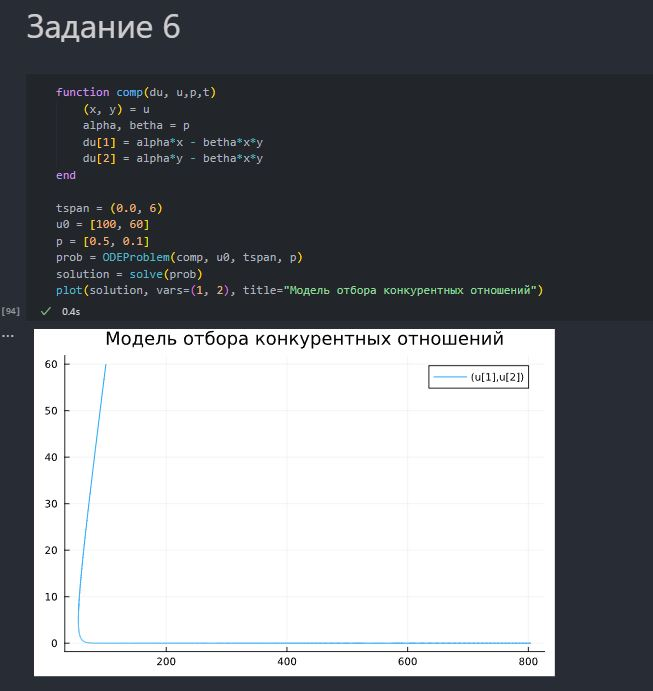{#fig:018 width=70%}

## Выполнение лабораторной работы

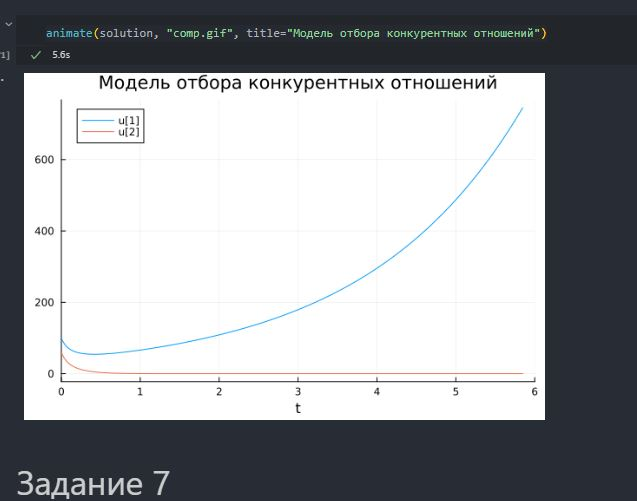{#fig:019 width=70%}

## Выполнение лабораторной работы

Реализуем на языке Julia модель консервативного гармонического осциллятора:

$$
\ddot x + \omega _0 ^2 = 0, x(t_0) = x_0, \dot x(t_0) = y_0.
$$

## Выполнение лабораторной работы

В задании 7 построим соответствующие графики (в том числе с анимацией) и фазовый портрет (рис. [-@fig:013]-[-@fig:014]).

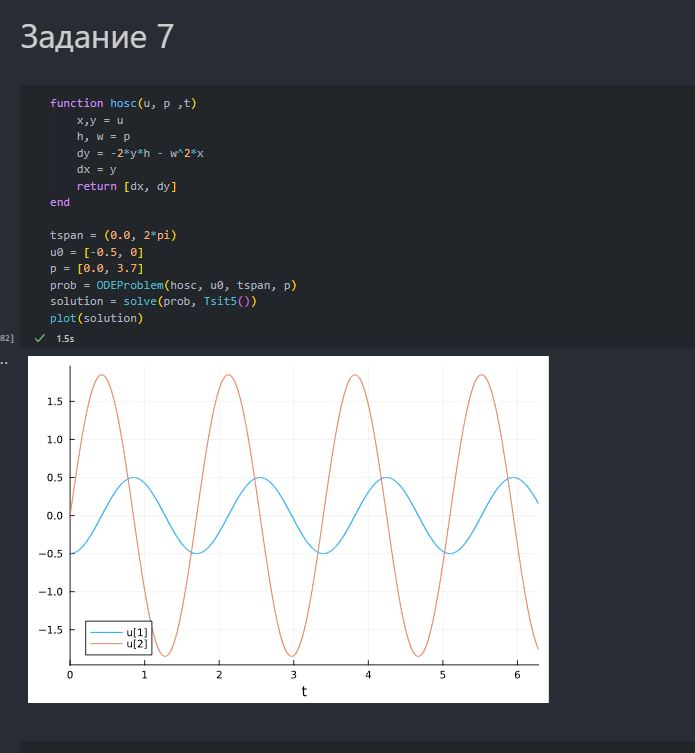{#fig:020 width=70%}

## Выполнение лабораторной работы

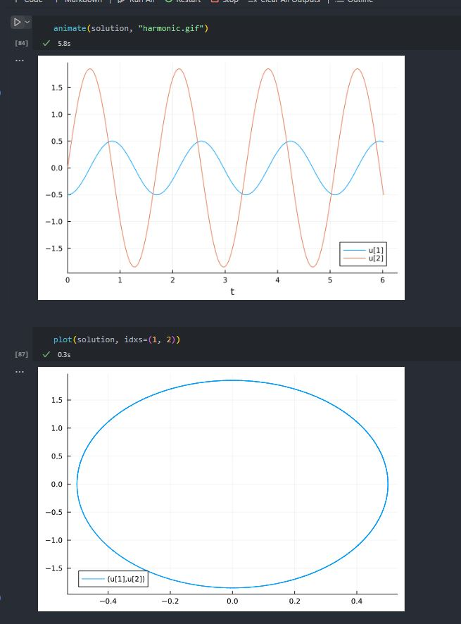{#fig:021 width=70%}

## Выполнение лабораторной работы

Реализуем на языке Julia модель свободных колебаний гармонического осциллятора:

$$
\ddot x + 2\gamma \dot x + \omega _0 ^2 = 0, x(t_0) = x_0, \dot x(t_0) = y_0.
$$

Построим соответствующие графики (в том числе с анимацией) и фазовый портрет .

{#fig:022 width=70%}

## Выполнение лабораторной работы

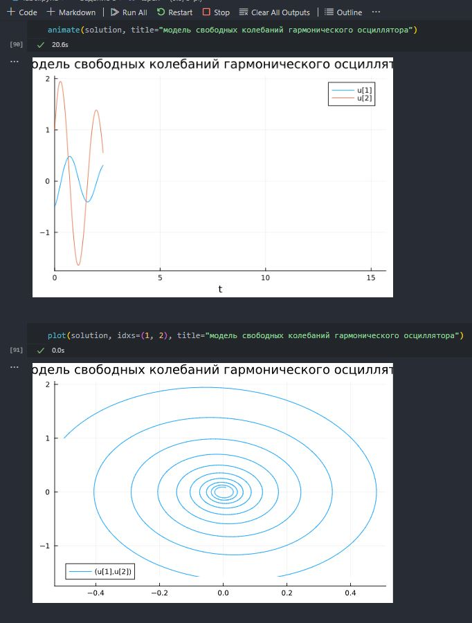{#fig:023 width=70%}

# Выводы

В результате выполнения данной лабораторной работы были освоены специализированные пакеты для решения задач в непрерывном и дискретном времени.
